# UTHM Faculty Club Management System

## Description

The UTHM Faculty Club Management System is a web-based application designed to streamline the recruitment processes of faculty clubs at Universiti Tun Hussein Onn Malaysia (UTHM). The system aims to address the challenges faced by faculty clubs in managing their member recruitment, enhance data security, and improve user experience.

## Features

- Streamlined recruitment procedures
- Enhanced data security through encryption and hashing techniques
- Multi-factor authentication (MFA) with security images and phrases
- Role-based access control (RBAC)
- User-friendly interface for easy navigation

## Screenshot (Student)

    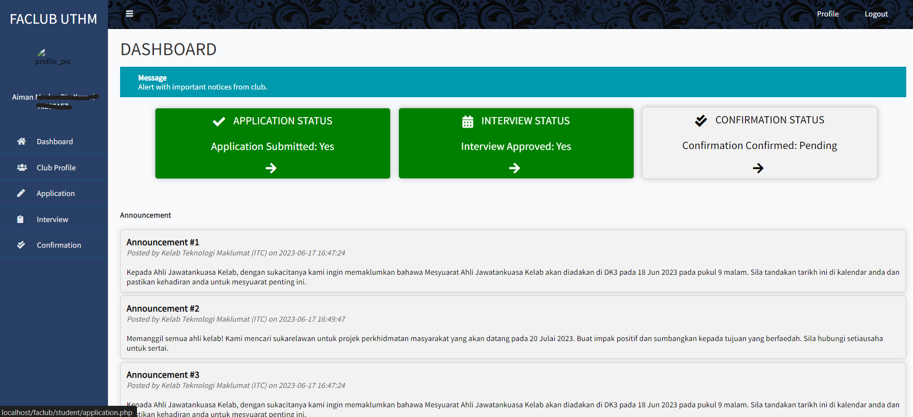
    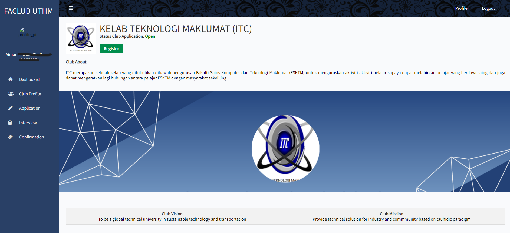

    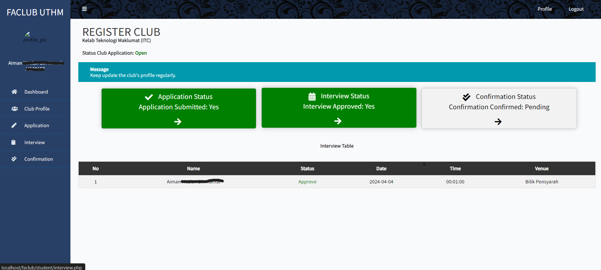
    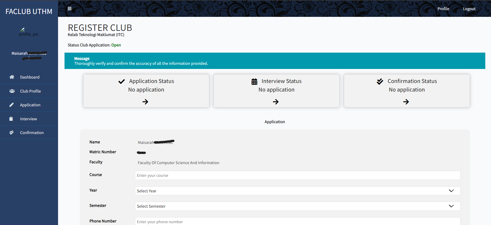

## Screenshot (Club)

    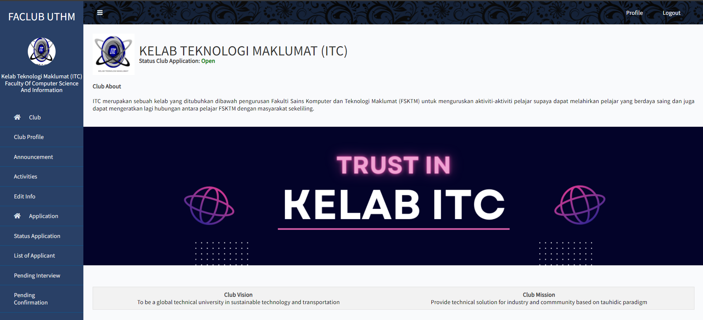
    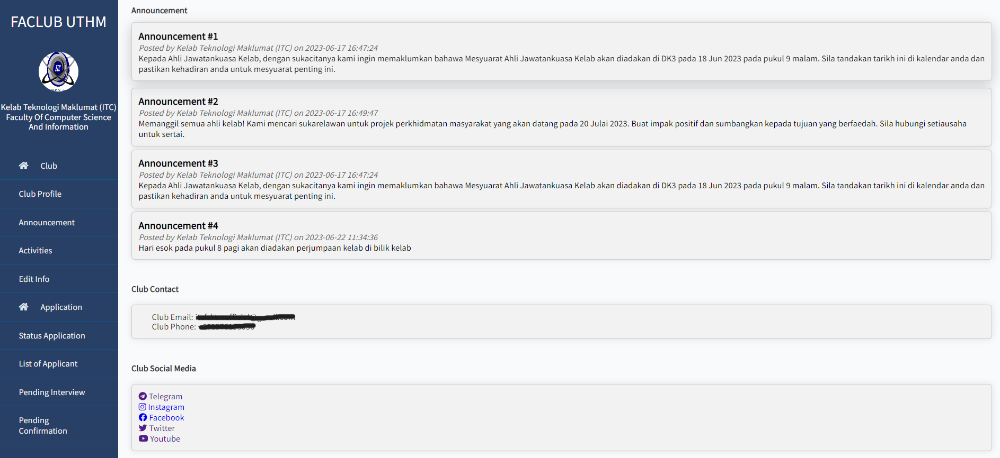

    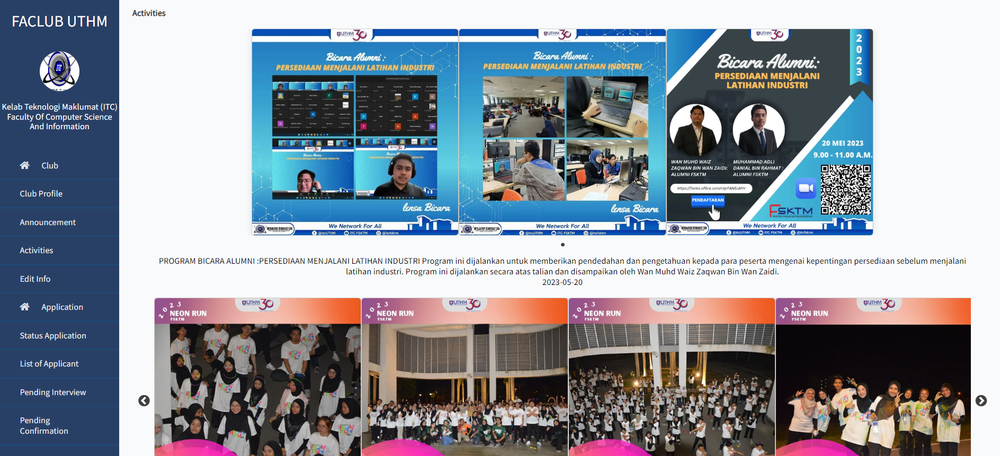
    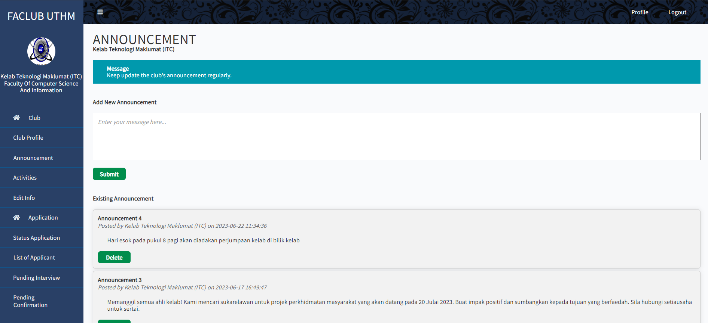

    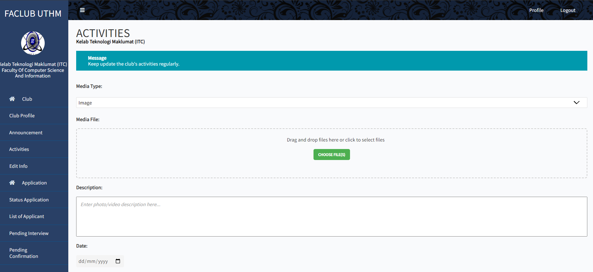
    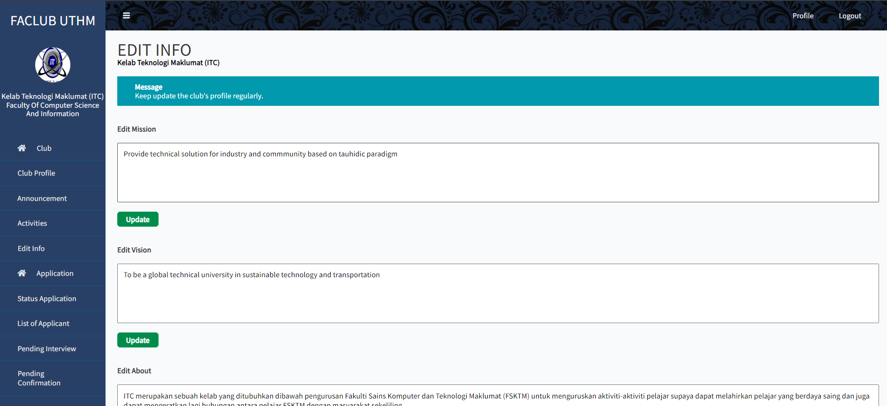

    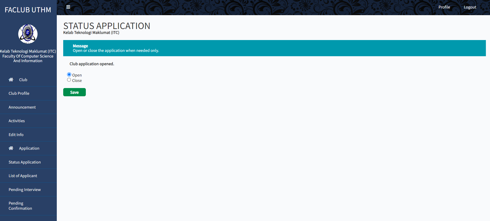
    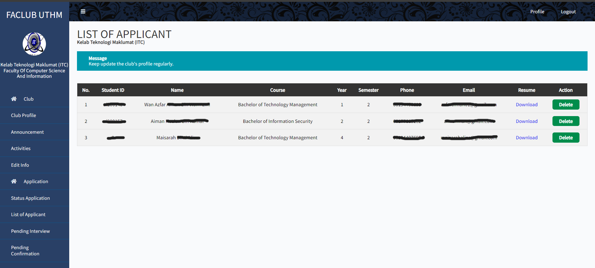

    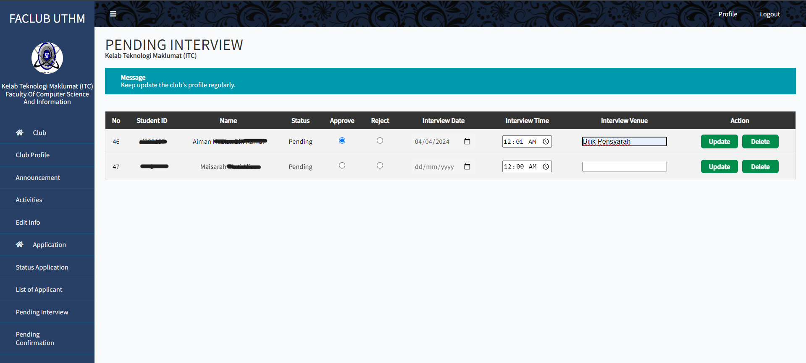
    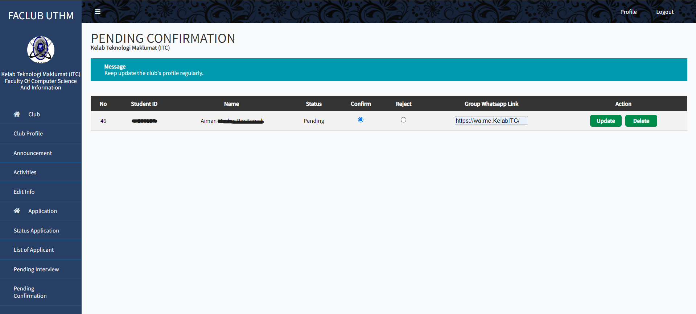

## Installation

1. Clone the repository: `git clone https://github.com/yourusername/uthm-faculty-club-management-system.git`
2. Navigate to the project directory: `cd uthm-faculty-club-management-system`
3. Install dependencies: `npm install`
4. Configure database settings in `config.js`
5. Start the server: `npm start`
6. Access the application in your web browser: `http://localhost:3000`

## Usage

1. Register an account as a student, club representative, or admin.
2. Log in to access relevant features based on your role.
3. Navigate through the application to manage club activities, announcements, and member applications.

## Contributing

Contributions are welcome! Please fork the repository, make your changes, and submit a pull request.

## License

This project is licensed under the [MIT License](LICENSE).

## Credits

Developed by Wan Azfar Aiman

